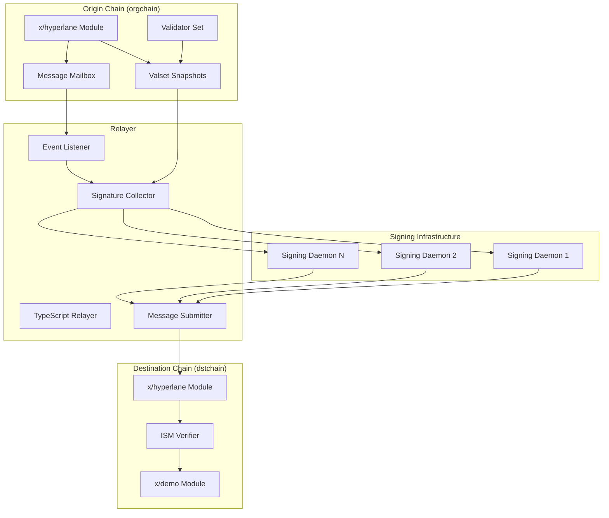

# Hyperlane with Enshrined Validators

A Cosmos SDK implementation of Hyperlane-style cross-chain messaging using enshrined validators as the Interchain Security Module (ISM).

## Overview

This project implements a cross-chain messaging protocol between two Cosmos SDK chains (`orgchain` and `dstchain`) where the origin chain's validator set serves as the security mechanism for message attestation. Instead of using external validators or optimistic verification, we leverage the existing economic security of the origin chain's validators.

## Architecture



## Key Components

### 1. Origin Chain (orgchain)
- **x/hyperlane module**: Handles message dispatch and validator set snapshotting
- **Validator set snapshots**: Periodic captures of the validator set for attestation
- **Message mailbox**: Stores outgoing cross-chain messages
- **Events**: Emits events for message sending and validator set changes

### 2. Destination Chain (dstchain)  
- **x/hyperlane module**: Verifies incoming messages using multisig attestations
- **ISM verification**: Validates signatures against historical validator sets
- **x/demo module**: Example application module that receives cross-chain messages

### 3. Relayer (TypeScript)
- **Event monitoring**: Watches origin chain for message send events
- **Signature collection**: Requests attestations from validator signing daemons
- **Message delivery**: Submits verified messages to destination chain

### 4. Signing Daemon (Go)
- **Key management**: Stores validator private keys securely
- **HTTP API**: Provides signing services for message digests
- **Secp256k1 signatures**: Compatible with Ethereum-style signatures

## Quick Start

### Prerequisites

- Go 1.22+
- Node.js 18+
- Ignite CLI v29+

### 3-Step Demo

1. **Build everything:**
   ```bash
   make build
   ```

2. **Run the demo:**
   ```bash
   make demo
   ```

3. **In another terminal, test the flow:**
   ```bash
   # Check services are running
   make health-check
   
   # View validator keys
   curl http://localhost:8080/pubkeys
   
   # Query chain status
   curl http://localhost:1317/cosmos/base/tendermint/v1beta1/node_info
   curl http://localhost:1319/cosmos/base/tendermint/v1beta1/node_info
   ```

## Manual Setup

### 1. Start Origin Chain
```bash
cd orgchain
ignite chain serve --reset-once
```

### 2. Start Destination Chain  
```bash
cd dstchain
ignite chain serve --reset-once --port-prefix 1
```

### 3. Start Signing Daemon
```bash
cd signing-daemon
./signing-daemon -generate  # Generate test keys
./signing-daemon            # Start daemon on port 8080
```

### 4. Configure and Start Relayer
```bash
cd relayer
cp env.example .env
# Edit .env with correct endpoints
npm run start
```

## Message Flow Example

1. **Send Message** (on orgchain):
   ```bash
   orgchaind tx hyperlane send-message \
     --dest-chain-id dstchain \
     --recipient-module demo \
     --body "Hello cross-chain world!" \
     --from alice
   ```

2. **Relayer Process**:
   - Detects `hyperlane_send` event
   - Fetches validator set snapshot
   - Requests signatures from validators  
   - Builds multisig proof
   - Submits to destination chain

3. **Message Delivered** (on dstchain):
   - Verifies multisig proof against valset
   - Checks replay protection
   - Dispatches to demo module
   - Emits `demo_received` event

## Security Model

### Enshrined Validators
- Uses the origin chain's existing validator set as the trust anchor
- No additional validator registration or slashing required
- Economic security scales with the origin chain's market cap

### Attestation Process
- 2/3+ voting power threshold for message validity
- Secp256k1 signatures over canonical message digests
- Replay protection via nonces and consumed message tracking
- Deterministic validator ordering for bitmap construction

### Key Features
- **Gas-efficient**: O(1) verification complexity
- **Trustless**: No external oracles or committees
- **Secure**: Leverages existing chain security
- **Flexible**: Supports arbitrary message payloads

## Configuration

### Chain Parameters
```go
type Params struct {
    EpochLength          uint64  // Snapshot frequency (default: 100 blocks)
    ThresholdNumerator   int64   // Quorum numerator (default: 2)
    ThresholdDenominator int64   // Quorum denominator (default: 3)
    MaxBodyBytes         uint64  // Message size limit (default: 32KB)
}
```

### Relayer Configuration
```bash
# .env file
ORGCHAIN_RPC=http://localhost:26657
DSTCHAIN_RPC=http://localhost:26659
VALIDATOR_SIGNERS=http://localhost:8080,http://localhost:8081
POLL_INTERVAL=5000
```

## Development

### Running Tests
```bash
make test
```

### Code Structure
```
.
├── orgchain/           # Origin chain implementation
├── dstchain/           # Destination chain implementation  
├── relayer/            # TypeScript relayer
├── signing-daemon/     # Go signing service
├── scripts/            # Demo and setup scripts
├── docs/               # Documentation
└── Makefile           # Build automation
```

### Building Individual Components
```bash
# Build chains
cd orgchain && ignite chain build
cd dstchain && ignite chain build

# Build relayer
cd relayer && npm run build

# Build signing daemon
cd signing-daemon && go build -o signing-daemon cmd/daemon/main.go
```

## Limitations (MVP)

This is a minimal viable product with several simplifications:

- **No slashing**: Validators can't be penalized for invalid signatures
- **Simple key management**: Private keys stored in plain JSON
- **Basic relayer**: No advanced retry logic or fee management
- **Limited ISM**: Only supports multisig verification
- **Development keys**: Not suitable for production use

## Future Enhancements

- **BLS signatures**: Aggregate signatures for efficiency
- **Slashing module**: Penalize validators for misbehavior  
- **Optimistic ISM**: Challenge-response verification
- **EVM compatibility**: Deploy as Ethereum L2/sidechain
- **Advanced relayer**: Economic incentives and MEV protection

## Documentation

- [Architecture Design Record](docs/ADR-01-enshrined-validators.md)
- [Validator Runbook](docs/validator-runbook.md)
- [API Documentation](docs/api.md)

## Contributing

1. Fork the repository
2. Create a feature branch
3. Make your changes
4. Add tests
5. Submit a pull request

## License

MIT License - see [LICENSE](LICENSE) for details.

## Acknowledgments

- [Hyperlane](https://hyperlane.xyz) - Original cross-chain messaging protocol
- [Cosmos SDK](https://cosmos.network) - Blockchain application framework
- [Ignite CLI](https://ignite.com) - Blockchain development platform
